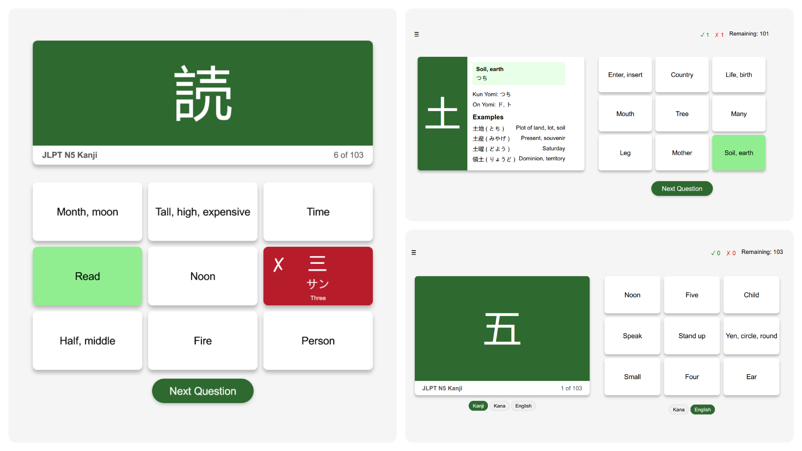

# JLPT N5 Kanji Flashcard Quiz 🎌

A web-based flashcard-style quiz for practicing all JLPT N5 kanji, featuring a 9-tile answer grid, detailed kanji info, and flexible question/answer modes. Can be compiled into an `.apk` using Cordova.

**Featuring 103 JLPT N5 Kanji!**

**Contributions are welcome!**



## Features

- **9-tile flashcard grid:** Each question presents 9 possible answers.
- **Flexible question/answer modes:** Switch between Kanji, Kana, or English for the question, and Kana or English for the answer.
- **Detailed kanji info:** After a correct answer, see readings, meanings, and example words.
- **Progress tracking:** See your correct/incorrect count and remaining kanji.
- **Responsive design:** Works well on desktop and mobile. Can be made into a mobile app.
- **Data-driven:** Loads kanji and example data from `db/N5.json`.

## Getting Started

### Prerequisites

- A modern web browser (Chrome, Firefox, Edge, Safari, etc.)
- A local or remote HTTP server (for local development, [Live Server](https://marketplace.visualstudio.com/items?itemName=ritwickdey.LiveServer) for VSCode is recommended)

### Installation

**Note:** React wasn't chosen in an attempt to make it easy to make a WebView of it on Android.

1. **Clone or download this repository.**
2. **Ensure the following structure:**
    ```
    <project_folder>/
      www/
        css/
          index.css
        db/
          N5.json
        img/
          icon.png
        js/
          index.js
        index.html
    config.xml
    package.json
    package-lock.json
    ```
3. **Start a local server** in the `www` directory.

### Android Compiling Instructions:

1. Run `npm install`
2. Run `cordova build android`
3. Your `.apk` will be in `platforms\android\app\build\outputs\apk\debug\app-debug.apk` directory/file.

### Usage

- Open `index.html` in your browser via your local server.
- Use the mode buttons to switch question/answer types.
- Click an answer tile to select your answer.
- Review kanji details after correct answers.
- Click "Next Question" to continue.
- Progress and remaining kanji are shown at the top and in the question footer.

## Customization

- **Kanji Data:** Edit or expand `db/N5.json` to add or modify kanji and examples.
- **Styling:** Modify `css/index.css` for appearance tweaks. (it's a bit of a mess right now)
- **Icons:** Replace `img/icon.png` for a custom favicon.

**JSON Format**:
```json
{
  "JLPTLevel": 5, --> Use 0 for Kana
  "MatchCards": [
    {
      "Examples": [
        {
          "KanjiWord": "一つ",
          "KanaWord": "ひとつ ",
          "EnglishWord": "One thing",
          "JLPTLevel": 5
        },
        {
          "KanjiWord": "一人",
          "KanaWord": "ひとり ",
          "EnglishWord": "One person, alone",
          "JLPTLevel": 5
        }
      ],
      "Kanji": "一",
      "Kana": "イチ",
      "English": "One",
      "OnYomi": "イチ, イツ",
      "KunYomi": "ひと, ひと(つ)"
    }
  ]
}
```

## Development

- All logic is in `js/index.js`.
- The UI is built in `index.html` and styled with `css/index.css`.
- No frameworks or build tools required.

## License

CC0-1.0 license

## DISCLAIMER

AI was heavily used for the development of this project.
**HOWEVER**, exhaustive human oversight was involved in the coding, designing and decision making of the entirety of it. **IT IS NOT 100% AI NOR WOULD AI ALONE GET YOU THIS FAR!**

## Credits

The idea is inspired from http://www.studykanji.net, however, as there is no portable version for Android systems nor can it be used offline, there was a necessity to create a similar project. The kanji readings (namely the JSON) comes mostly from their site.

**No development to closely resemble ALL or MOST of their features will be done.** This is purely a barebones flashcard version.

---

**Created by James for JLPT N5 Kanji learners. 💝**
